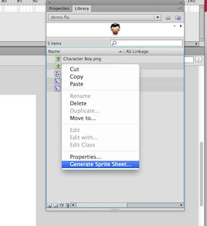
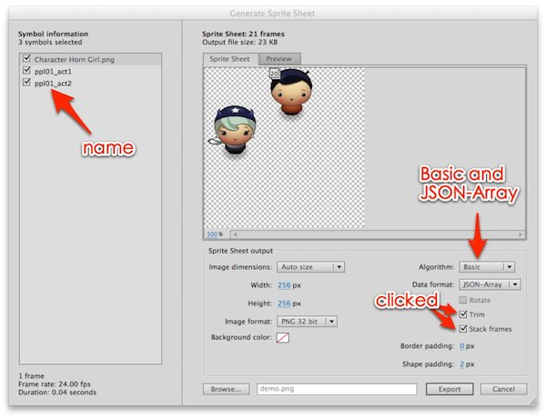

#FLSprite

FLSprite is a [CoronaSDK](http://coronalabs.com/) class for Adobe Flash CS6+ SpriteSheet JSON-Array Output.

> How to create sprite sheet in Flash CS6+ 
> [http://helpx.adobe.com/flash/using/create-sprite-sheet.html](http://helpx.adobe.com/flash/using/create-sprite-sheet.html)

##How to use?
Select those clips in Library and right click the `Generate Sprite Sheet...` in Adobe Flash CS6+.

Choose `JSON-Array` for the output data format.

## Converts JSON file to UTF-8 encoding.
<b>Adobe Flash sprite sheet json file output is a UTF-16 encoding text file. Remember to encode it to the UTF-8. Otherwise, CoronaSDK will get an error of it. If your are using `Sublime Text` editor. You can find the `Save with Encoding` function in dropdown menu `File`.</b>

> [UTF-16 to UTF-8 online converter](http://www.fileformat.info/convert/text/utf2utf.htm)

##Usage:

    local FLSprite = require "FLSprite"

    -- FLSprite.load( jsonPath [,optional: system path ][, optional: isPreload boolean ] )
    -- local sheetInfo = FLSprite.load("demo.json")
    -- isPreload=true,  preload texture in memory
    local sheetInfo = FLSprite.load("demo.json", true)
    local sheet = sheetInfo:getImageSheet()

### New Image
    -- newImage
    local girl = display.newImage( sheet, sheetInfo:getFrameIndex("Character Horn Girl.png" ))
    girl.x = 100; girl.y = 100

### New ImageRect
    -- newImageRect
    local frameIndex, frameData = sheetInfo:getFrameData("Character Horn Girl.png")
    local girl1 = display.newImageRect( sheet, frameIndex, frameData.width, frameData.height )
    girl1.x = 180; girl1.y = 100

###Sprite

    -- sprite
    local data = sheetInfo:getSequenceData("ppl01_act1")
    -- rewrite loopCount, default is loop
    data.loopCount = 3
    -- rewrite loopDirection
    data.loopDirection = "bounce"
    local sp = display.newSprite( sheet , data )
    sp.x = 180; sp.y = 240
    sp:play()

    -- sprite for all actions
    local index = 2
    local data1 = sheetInfo:getSequenceData()
    local sp1 = display.newSprite( sheet , data1 )
    sp1.x = 120; sp1.y = 320
    sp1:play()

    local function swapSheet()
        sp1:setSequence( "ppl01_act"..index )
        index = index==2 and 1 or 2
        sp1:play()
    end

    timer.performWithDelay( 2000, swapSheet, 0 )

###Clear cache
    -- remove all groups and then...
    FLSprite.clear("demo.json")

    --clear all caches
    FLSprite.clear()